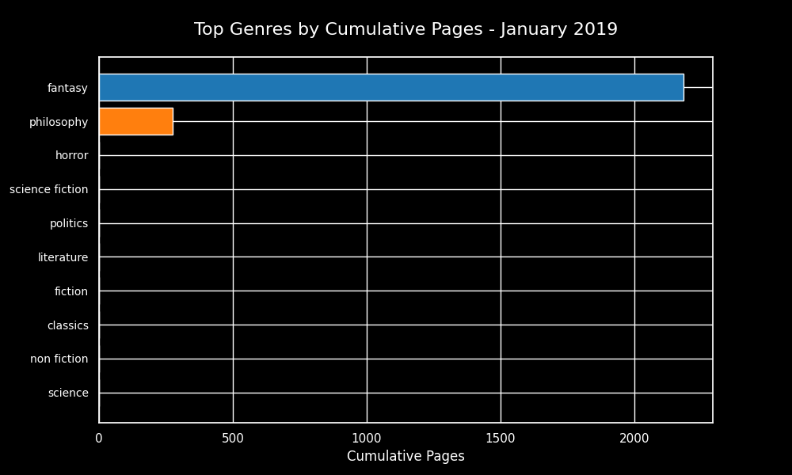
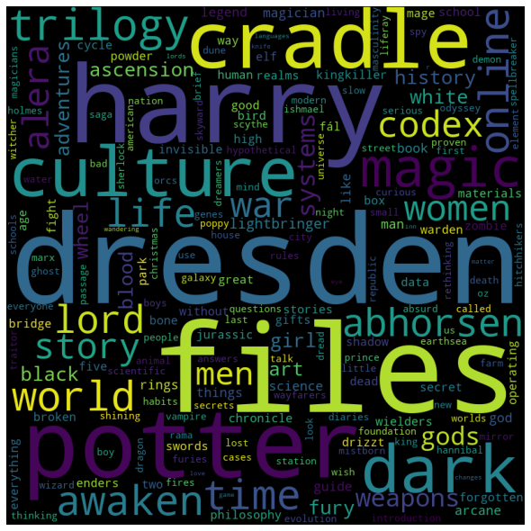
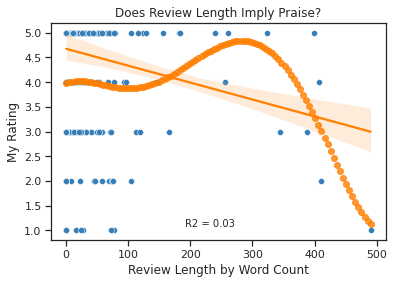
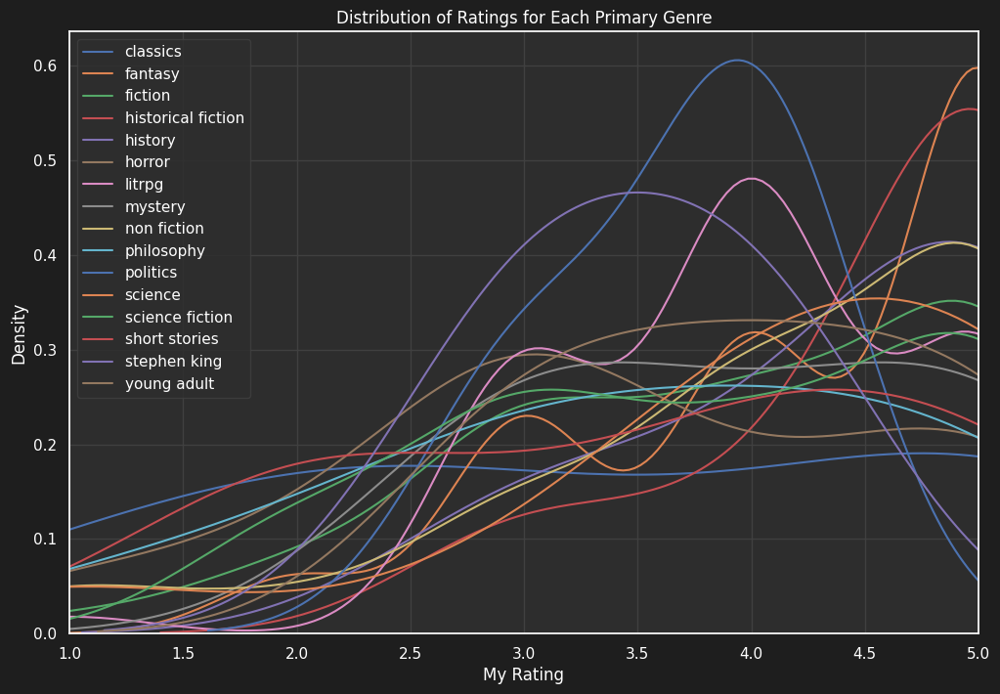
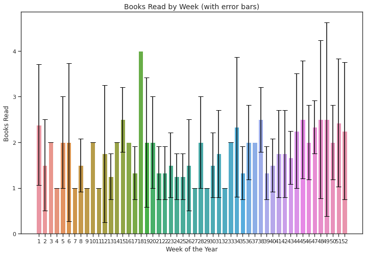
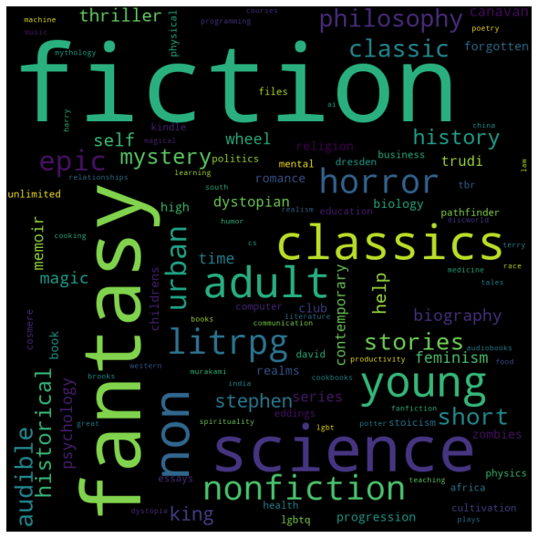

# GoodReads Data Analysis

A comprehensive analysis of personal reading habits using data exported from [GoodReads](https://www.goodreads.com/). Demonstrates data wrangling, statistical visualisation, NLP-based sentiment analysis, and predictive modelling with classical ML and neural networks.

## Techniques Demonstrated

| Category | Details |
|---|---|
| **Data Wrangling** | Pandas preprocessing, date parsing, genre standardisation |
| **Visualisation** | Seaborn, Matplotlib, Plotly, animated bar-chart races |
| **NLP** | NLTK VADER sentiment analysis, word clouds, stopword filtering |
| **Classical ML** | Linear & polynomial regression, Random Forest (scikit-learn pipelines) |
| **Deep Learning** | Keras feed-forward NN, PyTorch classification with early stopping |
| **Best Practices** | Proper train/test splits, no data leakage, centralised theming |

## Using Your Own Data

1. Export your GoodReads library via **My Books → Import/Export** (bottom-left of profile).
2. *(Recommended)* Enrich the CSV with [Enhance-GoodReads-Export](https://github.com/PaulKlinger/Enhance-GoodReads-Export) to add genre tags and more accurate reading dates.
3. Open the notebook in Colab, uncomment the Google Drive mount cell, and point it at your CSV.

## Example Outputs

| | |
|---|---|
|  |  |
|  |  |
|  |  |

## A Note on Predictions

The ML models here yield modest accuracy — by design. Book ratings and reading speed are driven more by personal context (mood, genre engagement, life circumstances) than by metadata like page count or average rating. The low R² scores are themselves a useful finding: they illustrate why recommendation systems need collaborative filtering or deeper content features to work well.

## License

This project is licensed under [CC BY 4.0](LICENSE). Issues and forks welcome — just link back to this repo.
