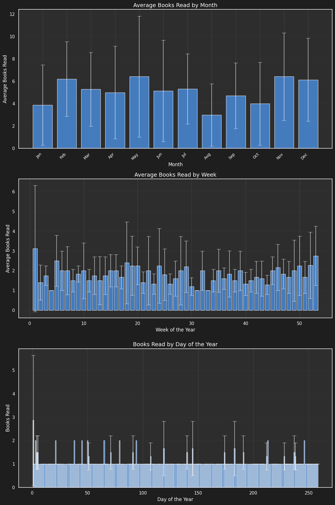
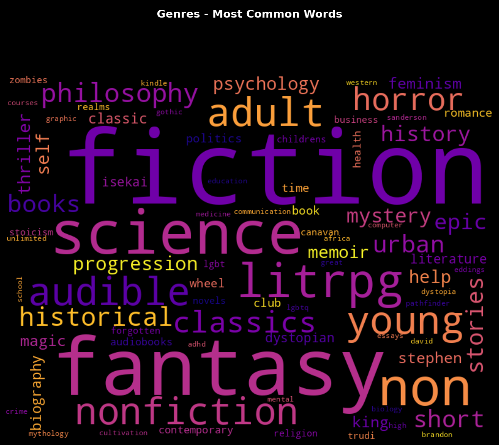

# GoodReads-Analysis

## Introduction

I realized while applying for jobs I had very little on my GitHub. I decided to put together a sampler of various DS skills, including some preprocessing of data, plot creation, machine learning, analysis, etc. But what dataset to use? Well, why not my GoodReads data? I already have it freely available! 

## How can I use my own data?

See the very top of the notebook for instructions, you just need a GoodReads account with some data in it, and ideally a willingness to use the goodreads enhancement tool (see next point).

## Libraries and such?

They're all mentioned inside the notebook, I use many, but I wanted to give particular thanks to [Enhance-Goodreads-Export](https://github.com/PaulKlinger/Enhance-GoodReads-Export) which unlocked genres and more accurate dates read.

## Examples of plots this creates

## Hey, the machine learning examples don't perform well...

ML algorithms are limited by the quality of the input data. Sadly, the major downside of this project is that most people (myself included) haven't read enough books to make even considering these techniques a sensible choice. This is for learning and playing with code more than anything, don't expect this to provide you with uncanny predictions into your future reading habits!

## Licence

This is licenced under CC licencing. Feel free to raise issues for suggestions, bug fixes, etc., and feel free to fork and modify your own version, just please refer back to here if you do.
