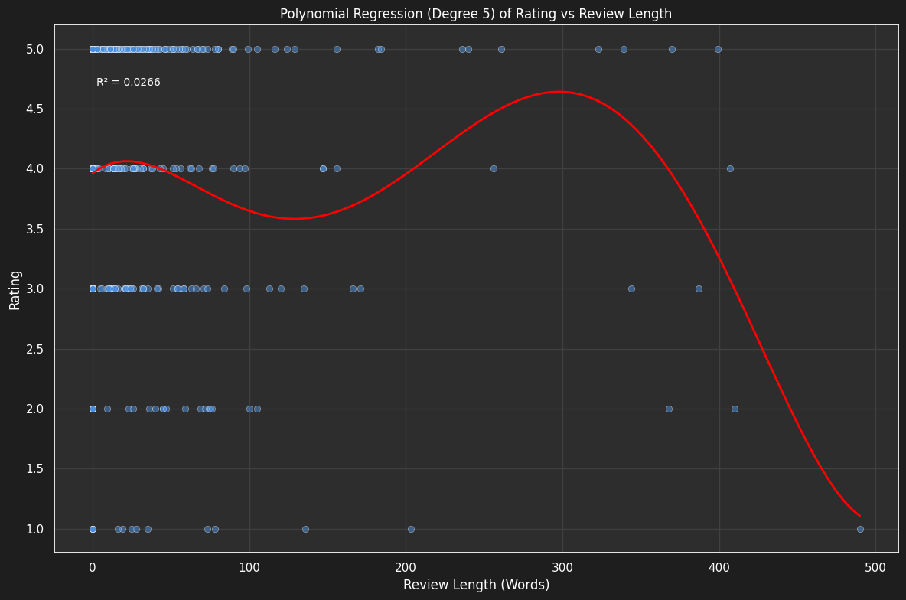

# 📚 GoodReads Analysis 📊

## 🌟 Introduction
Realized your GitHub was looking a bit sparse? Same here! 😅 This project is a sampler of various Data Science skills, from data preprocessing to plot creation, machine learning, and analysis. And what better dataset to use than your own GoodReads data? 📖

## 🤔 How can I use my own data?
1. Head to the top of the notebook for step-by-step instructions.
2. You'll need a GoodReads account with some reading history.
3. For best results, use the GoodReads enhancement tool (more on that below).

## 🛠️ Libraries and Tools
The notebook uses a variety of libraries, all mentioned within. Special shoutout to [Enhance-GoodReads-Export](https://github.com/PaulKlinger/Enhance-GoodReads-Export) for unlocking genres and more accurate reading dates! 🎉

## 📊 Example Plots

Here's a taste of what you can create:

*Your reading journey in a cloud!*

*Do longer reviews mean better ratings?*

*Which genres do you rate the highest?*

*Your reading habits throughout the year*

*The genres that dominate your bookshelf*

## 🤖 Machine Learning Disclaimer
Don't expect mind-blowing predictions - the algorithms are limited by input data quality. Most of us (myself included) haven't read enough books to make these techniques truly shine. This project is more about learning and playing with code than uncanny predictions of future reading habits!

## 📜 License
This project is under CC licensing. Feel free to:
- 🐛 Raise issues for suggestions or bug fixes
- 🍴 Fork and modify your own version (just please link back to this repo)

Happy reading and analyzing! 📚📊🎉
